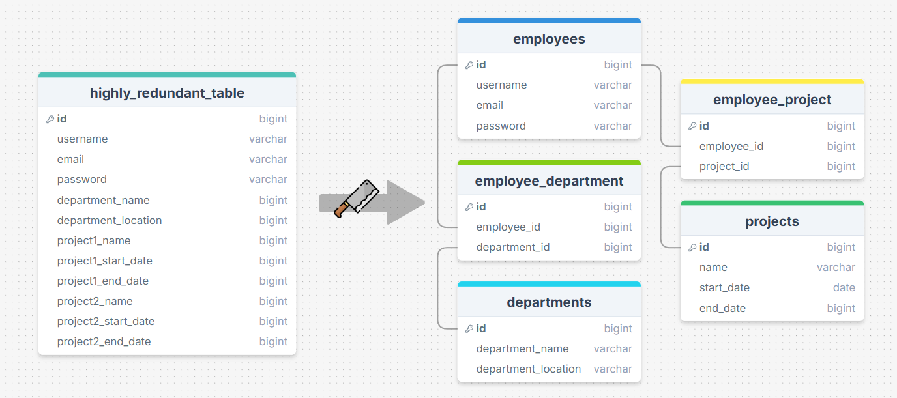
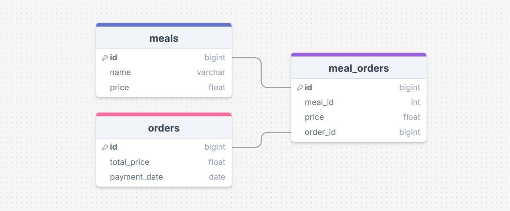
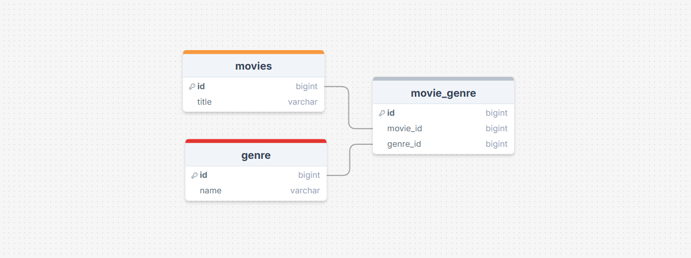

# Data Normalization And Denormalization

Normalization and Denormalization are two core database design strategies which have a big impact on:

* Data Integrity
* Storage Efficiency
* Query Performance
* System Complexity

If normalization is introducing organization and cleanliness to a database, then denormalization is synonymous with introducing a whole world of mess to it.

Let's talk about making our databases clean and well-structured, then we can talk about why is this not always a good a choice.

## Normalization

Normalization is a process during which you break a table into logically divided sub-section. This is where you decide which column belongs to which table and if you need some extra tables or not.

When you are starting from scratch, and you are just brain storming about what the database should look like, a good practice is to dump all the columns required from the application and then start butchering it down to separate sections, all the while you ask yourself "_should this column go into this table or does it need a table of its own?_"

Here are a few more questions to ask during the above process:

* Is this data **repeated** across rows?
* Can this group of fields be reused elsewhere?
* Will I need to **filter, sort, or join** on this?
* Is this field **dependent** on the primary key or partially/compositionally related?

<figure><figcaption><p>A redundant table butchered into smaller tables</p></figcaption></figure>

Normalization our database comes with some benefits i.e. reduced _redundancy_ and improved _data consistency_. But what do they actually mean?

Redundancy is when, you have duplicate columns across different tables. Reducing redundancy means,  you remove the duplicates from other tables and keep that data in just one place.

Consistency is a by-product of reduced redundancy. It is when there is a single column for a single piece of information e.g. age should be found in the `user_profile` table and nowhere else.

Let's understand this with an example:

<figure><figcaption><p>A redundant schema where "price" column is in all three tables, in one form or another</p></figcaption></figure>

Would you say that this schema contains redundancy? Obviously you would point out the `price` column which is present in both the `meals` table and the `meal_orders` table. Moreover there is a derived column in the `orders` table named as `total_price` , which you can probably guess is the total sum of all the meals ordered in a single order.

So in conclusion the above schema contains redundancy. And as it happens, normalizing it is very simple. You just eliminate the `price` column from `meal_orders` table and `total_price` from `orders`table.

So the next time you want a total sum of all the meals ordered in a single order, you would do a query like this:

```sql
SELECT sum(price) FROM meal_orders AS mo INNER JOIN meals AS m 
ON mo.meal_id = m.id 
WHERE order_id = 123;
```

## Denormalization

Just to keep us both on the same page, denormalization in databases is not always seen as a _defect_ or _something wrong_. Yes, it has its downsides, but it is rarely talked about in schools when should we denormalize our database _on purpose_.

To demonstrate, we will use the example I shared above which includes `meals`, `meal_orders` and `orders` tables. The redundancy introduced in it can be necessary for a number of reasons.

* Admin may change the price of `meals` on the fly. So in that case, what will we do if want to know how much money the user paid for a certain meal at a certain time?
* User may use a discount on the total price of the order. In this case, having the `total_price`  column inside `orders` table can be helpful. &#x20;
* Having these redundant columns in our database actually help us keep a report or how much money came into the system and how much was discounted. The app owner might need this report for his accountant.

Turns out the redundancy which we were considering _bad_, was actually helpful for a lot of use-cases.

Denormalization can be just as necessary as normalization in certain scenarios. And before you ask, no there is no way to know when to use what. Just be aware of your use-case and the clients requirements and learn to think for yourself.

Let's look at some more scenarios where denormalization can be necessary.

## Movie Genre

A movie can have multiple genre, and a single genre can belong to multiple movies. So it only makes sense to have the schema look like this:

<figure><figcaption><p>A normalized schema of movies and their genres</p></figcaption></figure>

But think about Netflix. No it is not the time to be distracted. Think about what would they do if they had to fetch millions of movies along with their genres to perform their machine learning and sciency stuff?

Joins are good, but they can prove to be very computationally expensive in such scenarios. Now I know exactly what you are thinking. We can not use meals and orders example here, since there are no repeated columns. So what do we do?

A good solution is that instead of creating two separate tables just for the sake storing genre information, you could just make do with one or none at all. Let's elaborate.

There are two ways to approach this. First one is:

1. Create a column named `genre` in the `movies` table.
2. Store JSON array inside it like this `["horror", "sci-fi"]`.&#x20;

This way you would not need to create two separate tables. But using this way, you would not have a consistent naming scheme for the genres. "Sci-fi", "sci-fi" and "scifi" would be counted as three different genres.

As for the other way to do this:

1. To work around the problem of _inconsistent naming scheme_, we can still keep the `genre` table, but remove the `movie_genre` table.&#x20;
2. Instead we again introduce a JSON column in the `movies` table and fill it with genre IDs this time like this `[1,4,7]`.&#x20;
3. You can use your ORM to handle fetching relevant genres using this array in an optimized manner. Laravel has eager loading, Django has `__in` variable naming convention etc.

This way we are still using JOINS to fetch movie genres, but the number of JOIN operations are significantly less. Thus reducing the computational cost.

> :pushpin: If your database does not support JSON based columns, just use datatype `text` and store JSON as a stringified version. But when you load it through an Object Relation Mapper (ORM) you convert it into a hashmap, dictionary(in python) or object(in javascript).

This redundancy which we introduced using arrays in a JSON column, has its own drawbacks as well:

* Enforced FK constraints  - PostgreSQL does not enforce FK constraints on array elements
* Harder to join using raw SQL - You need to UNNEST() or use ANY()/JOIN LATERAL to match genres. But who cares when you are using an ORM which can do it in an optimized way?
* Hard to index efficiently - GIN index helps but filtering is more complex than flat joins. Again using an ORM helps a lot.

> :pushpin: I will stop right here regarding ORMs, since we will be discussing those in more detail in the upcoming chapters.

Now you know, that normalization and denormalization is just a game of trade-offs where you can only make right call if you are well aware of the requirements and future changes to some extent.

